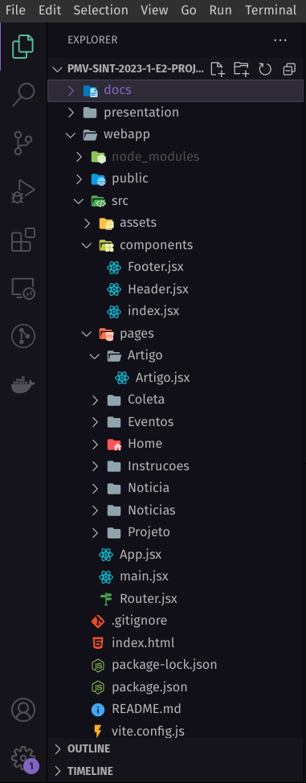
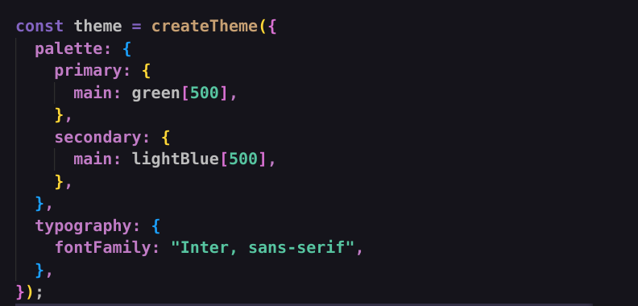
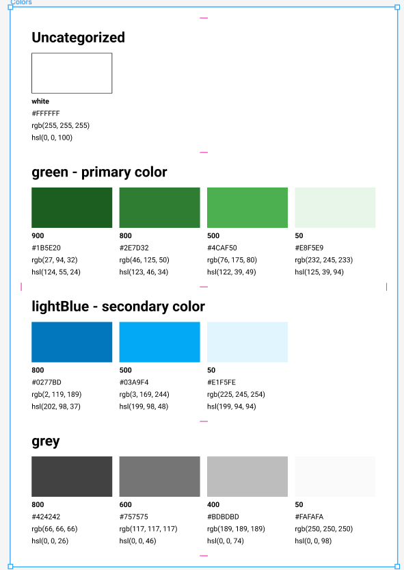

# 📔 Instruções de utilização

# ♻️ Projeto Catapiri - Documentação

## 📁 Estrutura de Pastas

### Estruturação de arquivos do Projeto

- Mantivemos as pastas e readmes criados previamente.
- A pasta root do projeto chama-se `webapp`, pois caso haja interesse em evoluir a aplicação, poderá ser criada uma pasta Mobile para manter todo o projeto no mesmo repositório.
- A pasta `webapp` tem toda a estrutura de pastas criadas pelo Vite (`node_modules`, `assets`, `public`) removemos os arquivos que não seriam usados, mas a estrutura de pastas permanece.
- Pasta `pages`, concentra todos os componentes de página, em cada pasta referente a uma página, já tem os arquivos .jsx referentes a cada página que definimos, (`NomeDaPágina.jsx` e `index.jsx`) mantive apenas um `h2` especificando cada uma. É nela que vocês irão desenvolver. Criei uma pasta para cada página, pois dentro dela poderão existir componentes referentes apenas àquela página que não serão usados em nenhum outro lugar do projeto.
- Pasta `components`, pasta para armazenar todos os componentes genéricos desenvolvidos (header, footer, menu). Já contém os arquivos dos componentes Header e Footer que serão usados em todas as páginas do projeto.
- Dentro da página `src` estão as pastas `components` e `pages` e ainda os arquivos `App.jsx`, `main.jsx`, `Router.jsx` e outros arquivos de configuração.
- `Router`: estão todas as rotas da aplicação.

## 💻 Coding Style

## 🖌️ Biblioteca Visual - MUI

- Estamos usando o Material UI como biblioteca visual do projeto. Na estrutura inicial do projeto já estão customizadas as cores primária e secundária, tipografia, seguindo as recomendações da documentação do MUI. Então ao adicionar um componente do MUI eles já vão obedecer nosso padrão de cores.

- As cores do projeto que estão no Figma são todas cores do MUI, então basta utilizar as propriedades do MUI para fazer alteração de cor.

- Sempre que forem desenvolver algum elemento, componente, verificar na documentação do MUI se já não existe um componente deles que possa ser usado.

[Overview - Material UI](https://mui.com/material-ui/getting-started/overview/)

## Estrutura a ser seguida na criação das pastas

Exemplos de como uma estrutura de pasta de página e de pasta de componente deve ser, por favor seguir o padrão.

- Pastas de Páginas contém:
  - um arquivo responsável pela página: `NomePagina.jsx`
  - um arquivo responsável por exportar a página: `index.jsx`
  - pode haver ou não outros arquivos de componentes específicos da página dentro da pasta `components` da pasta, que deve seguir a estrutura indicada a seguir.
    Essa estrutura facilita na hora de referenciarmos o componente da página.
- Pastas de componentes contém:

  - Contém cada arquivo `.jsx` de cada componente genérico, ou seja, que será utilizado em várias páginas do projeto.
  - Contém apenas um arquivo `index.jsx` com as exportações de todos os componentes desta pasta.
    A estrutura aqui, resolvi simplificar e não coloquei cada componente em uma pasta própria, pois creio que nossos componentes serão simples.

    ## Ambiente de desenvolvimento

### Sugestão de Plugins do VS Code

- Sugiro instalarem o **Material Icon Theme** - ele tem uma estruturação de ícones de pastas que facilita muito a vizualização.

Name: Material Icon Theme
Description: Material Design Icons for Visual Studio Code
Version: 4.25.0
Publisher: Philipp Kief
VS Marketplace Link: [https://marketplace.visualstudio.com/items?itemName=PKief.material-icon-theme](https://marketplace.visualstudio.com/items?itemName=PKief.material-icon-theme)

- Sugiro instalar o **Prettier** e configurar para que ele execute ao salvar o documento. Posteriormente pretendo colocar um arquivo de configuração do Prettier no projeto para que isso aconteça automaticamente.

Name: Prettier - Code formatter
Description: Code formatter using prettier
Version: 9.10.4
Publisher: Prettier
VS Marketplace Link: [https://marketplace.visualstudio.com/items?itemName=esbenp.prettier-vscode](https://marketplace.visualstudio.com/items?itemName=esbenp.prettier-vscode)

## Instalação do Site

O site em HTML/CSS/JS é um projeto estático, logo pode ser utilizado tanto em servidores...

## Histórico de versões

### [0.1.0] - DD/MM/AAAA

#### Adicionado

- Adicionado ...
